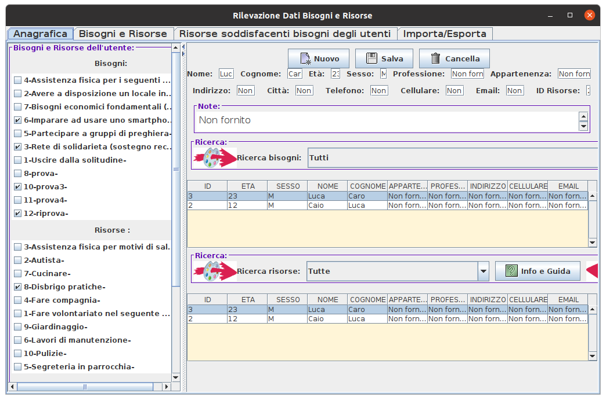

# BisogniRisorse
Programma in Java Swing con database Derby per gestire i bisogni e le risorse o disponibilità delle persone

Ogni persona ha sia bisogni che risorse. Questo programma mira a collegare i bisogni e le risorse o disponibilità delle persone.

Se una persona è sola, potrebbe cercare compagnia e viceversa.
Se una persona ha fame, può cercare qualcuno che la nutra.
Se una persona è malata, potrebbe cercare qualcuno che lo assista e viceversa
chi sta bene potrebbe cercare una persona da assistere.

Il programma consente di cercare sia i bisogni che le risorse.
Se trovi una risorsa in grado di soddisfare un bisogno, l'ID risorsa può essere registrato nella casella di testo "ID risorsa" dell'utente.

Il programma è in inglese e italiano.

Per avviare il programma dopo averlo scaricato e installato Java, vai nella dir pacchetto, entra nel terminale e digita "java -jar RilevazioneDati.jar" , digita la password timase e prova il software.
